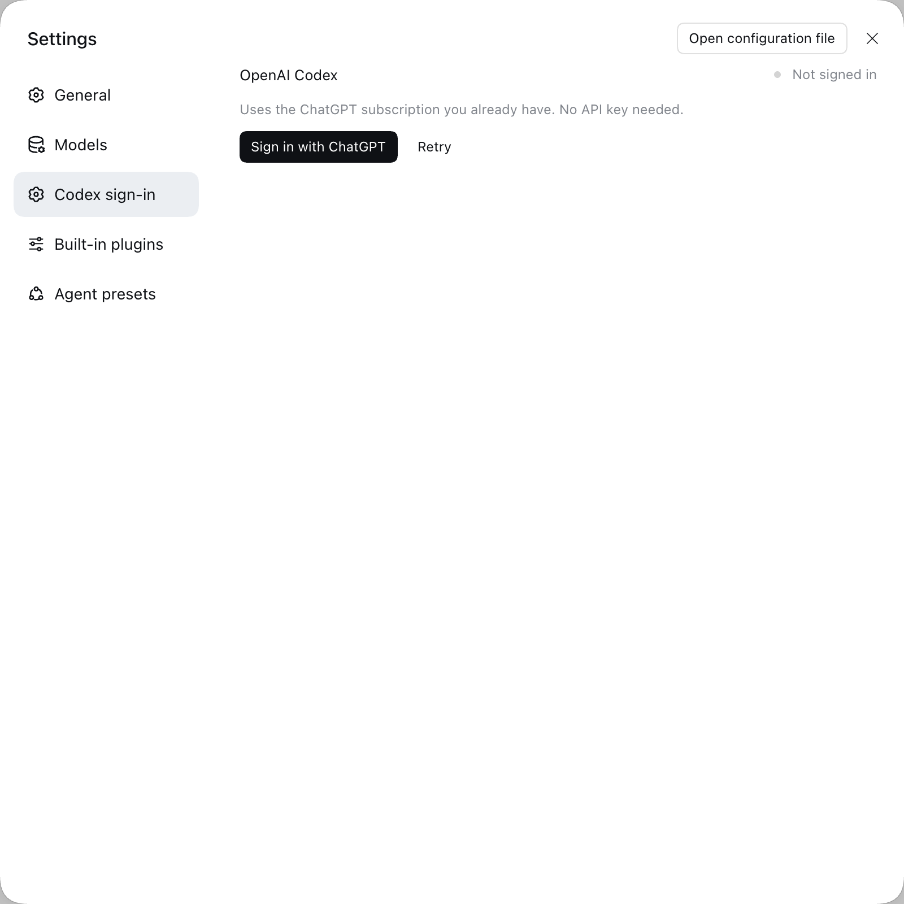

# dsh-codex-oauth

**Sign in to OpenAI Codex from DeepSeek Harness with the ChatGPT Plus/Pro subscription you already have.**

[](LICENSE)
[](https://github.com/deepseek-ai/deepseek-harness)
[](https://github.com/topics/dsh-plugin)
[](README.zh.md)

English | [中文](README.zh.md)

---

DeepSeek Harness already ships everything needed to run Codex: the browser and
device-code OAuth flow, the token refresh, the credential store, and the
transport to `chatgpt.com/backend-api`. What it does not ship is a surface that
starts the sign-in. Across the whole installation `ctx.authorization.begin()`
has exactly one caller, and it belongs to DeepSeek's own account — the
`openai-codex` flow is registered, and nothing lights it.

This plugin is that switch, and nothing else. It implements no OAuth, stores no
token, and owns no refresh loop.

## Contents

- [Requirements](#requirements)
- [Set it up with an AI agent](#set-it-up-with-an-ai-agent)
- [Install](#install)
- [Use](#use)
- [How it works](#how-it-works)
- [Compatibility](#compatibility)
- [Troubleshooting](#troubleshooting)
- [Development](#development)
- [Security](#security)
- [License](#license)

## Requirements

| | |
|---|---|
| DeepSeek Harness | `0.2.0-rc.2` — the line this plugin is built and verified against |
| Surface | any profile that mounts `dsh-base` (Desktop, `web`, headless) |
| Account | a ChatGPT Plus or Pro subscription |
| Profile config | a **keyless** `openai-codex` route — see below |

## Set it up with an AI agent

Everything in [INSTALL.md](INSTALL.md) is mechanical. Paste this into your
Harness agent and let it do the work:

```text
Install the DeepSeek Harness plugin at https://github.com/callqh/dsh-codex-oauth
for the profile I am running, then verify it. INSTALL.md in that repository has
the exact steps.

Rules:
- Touch only my profile under ~/.dsh/profiles/, and back up any file before you
  edit it.
- The openai-codex route must stay KEYLESS: providers: { "openai-codex": {} }.
  Never add apiKeyEnv — it swaps the ChatGPT subscription auth for an API key.
- If my profile is `desktop`, the dsh CLI refuses to manage it; use the in-app
  plugin manager.
- Do not restart Harness yourself. Tell me when to.

Then report: the profile and version you found, what you changed, how you
installed, what I should see in Settings -> Codex sign-in, and anything that
failed, quoted verbatim.
```

## Install

This is the short version. **[INSTALL.md](INSTALL.md) is the full walkthrough** —
every command, what each screen should show, and what to do when it does not.

### 1. Declare the route

Add this to the profile's `cordis.patch.yml`
(`~/.dsh/profiles/<profile>/cordis.patch.yml`):

```yaml
- id: llm-pi-ai
  name: "@deepseek-ai/dsh-llm-pi-ai"
  config:
    providers:
      openai-codex: {}
```

An empty value is a **keyless** profile: it keeps the provider's own
authentication, which for `openai-codex` is pi-ai's ChatGPT OAuth — the grant
this plugin writes.

**Do not give it an `apiKeyEnv`.** That replaces the provider's auth with an API
key and the subscription sign-in stops working. If the route is missing or wrong
the card says so, and shows this snippet again.

### 2. Install the plugin

**From the plugin manager** (Desktop, and any profile you would rather not touch
by hand): open Settings → Plugins and install from the repository URL or a local
checkout. A Desktop profile is owned by the Electron application and its CLI
refuses to manage it, so this is the only route there.

**From the command line** (`web`, headless and other CLI-managed profiles):

```sh
# from GitHub
dsh plugin --profile web add github:callqh/dsh-codex-oauth

# or from npm
dsh plugin --profile web add dsh-codex-oauth
```

Then restart Harness. A profile's bundle list is composed at process start and
is not hot-reloadable.

## Use

Open **Settings → Codex sign-in**.



Not signed in, you get one button. Press it and the flow asks which login method
you want:

- **Browser login** (default) — the page opens in a new tab and the callback is
  caught on the host at `127.0.0.1:1455`. Usually nothing to paste.
- **Device code login** — the card shows a `XXXX-XXXX` code and the address to
  enter it on, for when the browser is somewhere else.

Once the browser step completes, the card switches to signed in within about a
second — no page refresh — showing a masked account, the plan tier and the
token's expiry. **Sign out** deletes the credential record.

The browser never receives an access or refresh token.
## How it works

Four capabilities belong to Harness; the plugin owns only the wiring between
them.

| Capability | Owner | What this plugin does |
|---|---|---|
| The OAuth protocol | pi-ai (`openai-codex` provider) | calls it |
| The conversation with the human | `ctx.authorization` | renders notices and prompts |
| The credential record and its refresh | `ctx.credentials` | reads presence, deletes on sign-out |
| The model transport | pi-ai → `chatgpt.com/backend-api` | nothing |

The plugin exposes five Remote methods — `status`, `signIn`, `answer`, `cancel`,
`signOut` — and mounts one settings section. That is the whole of it.

**Deliberately not implemented:** reading, copying or parsing a token;
refreshing one; deciding one is stale; writing profile configuration; importing
`~/.codex/auth.json`; multiple accounts.

## Compatibility

Built and verified against **DeepSeek Harness `0.2.0-rc.2`**.

### Upstream identifiers this depends on

None of these is a public contract, and all of them move with the runtime. The
blast radius is sign-in only: the request path reads pi-ai's own payload and
never goes through this plugin.

| Identifier | Value | Where it comes from |
|---|---|---|
| flow key | `llm-pi-ai/openai-codex` | `recordKeyFor(providerId)` in `dsh-llm-pi-ai` |
| method id | `oauth` | `loginMethods()`, naming `auth.oauth` |
| grant shape | `{ type: 'oauth', access, refresh, expires, accountId }` | pi-ai's `credentialsFromToken()` |
| settings section slot | `settings.section` | the shell |
| platform seed table | `react`, `react/jsx-runtime`, `@deepseek-ai/dsh-client-ui-primitives` | the web frontend's `staticModules` |

### The prerelease peer-range trap

Official `@deepseek-ai/*` packages are declared with an explicit prerelease
branch:

```jsonc
"@deepseek-ai/dsh-authorization": ">=0.2.0-rc.2 <0.3.0-0 || >=0.3.0-0"
```

Not because it reads better, but because node-semver only lets a prerelease
satisfy a range when *some* comparator in that range shares its exact
`major.minor.patch` tuple **and** carries a prerelease tag itself. A
broad-looking range — `>=0.0.1-rc.1 <0.2.0`, or even `>=0.0.0-0 <0.2.0-0` —
silently excludes every prerelease build. The range above admits `0.2.0-rc.2`
through the whole `0.2` line and `0.3.0-rc.1`; a later line's prerelease needs
another `||` branch, and `scripts/preflight.mjs` fails the build if the resolved
runtime stops being admitted.

### Verified

Automated lanes cover the build, 44 test cases across five lanes, and 26 checks
in a throwaway profile built from a real profile's patch layer — including
starting **both** sign-in branches against the real flow and withdrawing them,
the loopback callback server actually listening, the port released on cancel,
and the card rendering in a real browser with the real module loader, platform
seed table and slot ledger. See [VERIFICATION.md](VERIFICATION.md).

A real sign-in against OpenAI has also been completed on this machine: the
credential record it leaves is a `grant` under `llm-pi-ai/openai-codex`, and the
card reads it back as a masked account, a plan tier and an expiry.

Still unverified: a request to a Codex **model**. If that is where it breaks for
you, please open an issue with the console lines starting with
`[dsh-codex-oauth]`.

## Troubleshooting

The card is never blank, and it never fails silently. Each state means one
thing:

| What you see | What it means |
|---|---|
| A sign-in button | Everything is wired up |
| "Connecting to Harness…" | The Remote namespace is not published yet (it gives up after ~2s) |
| "Cannot reach the Harness sign-in service" | The client bundle mounted but its Remote contribution was refused — the console carries the host's reason |
| "ui-primitives module is missing …" | A host build that renamed a UI primitive; the card is disabled rather than allowed to blank the settings dialog |
| "The Codex route is not declared yet" | Step 1 is missing — the snippet is shown inline |

The bundle logs a few lines prefixed with `[dsh-codex-oauth]`. Grep the browser
console for that tag; the last one it prints says how far it got.

## Development

```sh
pnpm install
npm run check          # typecheck (host + client) → build → preflight assertions
npm test               # 44 cases, five lanes
npm run stage-verify -- --dsh <path to @deepseek-ai/dsh/lib/bin.js>
```

`stage-verify` builds a throwaway profile from a real profile's patch layer and
boots it in its **own temporary `DSH_HOME`**, so your `~/.dsh` is read and never
written. Run it before touching a profile you care about.

A packaged Desktop keeps the `dsh` payload inside `app.asar`, which Node cannot
import from. Extract it once:

```sh
npx @electron/asar extract \
  "/Applications/DeepSeek Harness.app/Contents/Resources/app.asar" /tmp/dsh-asar

npm run stage-verify -- --dsh /tmp/dsh-asar/dsh/node_modules/@deepseek-ai/dsh/lib/bin.js
```

### Layout

| Path | Contents |
|---|---|
| `src/index.ts` | host entry (default-exports the Service class) |
| `src/service.ts` | the `codexAuth` Remote service — the only place that touches a seam |
| `src/flow.ts` | upstream identifiers and the masked projection |
| `src/route.ts` | the optional settings probe for the profile route |
| `src/wire.ts` | the wire types both halves share |
| `src/client/` | browser half: section registration, card, dictionaries, error boundary |
| `tests/descriptors.test.mjs` | the Remote descriptors, run against the real typert registry |
| `scripts/preflight.mjs` | shape and importability assertions |
| `scripts/stage-verify.mjs` | one-shot end-to-end smoke in a throwaway profile; `--browser` adds a real-browser lane, `--screenshot <p>` regenerates the image above |

Both `lib/` and `client/client.js` are build outputs of `src/`. `client/client.js`
is **committed**, because some install paths block build scripts; `lib/` is built
by `prepare` on install and by `npm run check`. Run `npm run check` after
changing anything under `src/`.

## Security

Tokens stay on the host. The credential lives in exactly one place — the harness
credential store, under `llm-pi-ai/openai-codex`, written by pi-ai in pi-ai's
format — and the browser receives only a masked account, a plan tier and an
expiry. See [SECURITY.md](SECURITY.md) for the full boundary, including what
this plugin reaches and what it deliberately cannot.

## License

[MIT](LICENSE)
